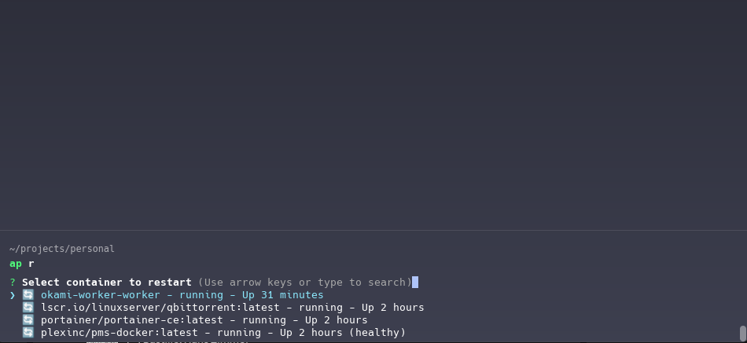

## Apolo docker CLI


<div align="center">
  
</div>

<p>
  
Apolo is my personal CLI for docker but it could be yours too :smile:. 
Helpers and macro commands to make docker easier
</p>


### Install

```shell
 npm i apolo-docker-cli -g
```


### Commands


#### Logs

List all up container to log

```shell
 ap l 
```


#### UP

List all off container to up
```shell
 ap up 
```


#### Restart container

```shell
 ap r
```



#### Down

List all up container to down
```shell
 ap st 
```


#### SH


List all up container to run any command
```shell
 ap sh {command} 
```


